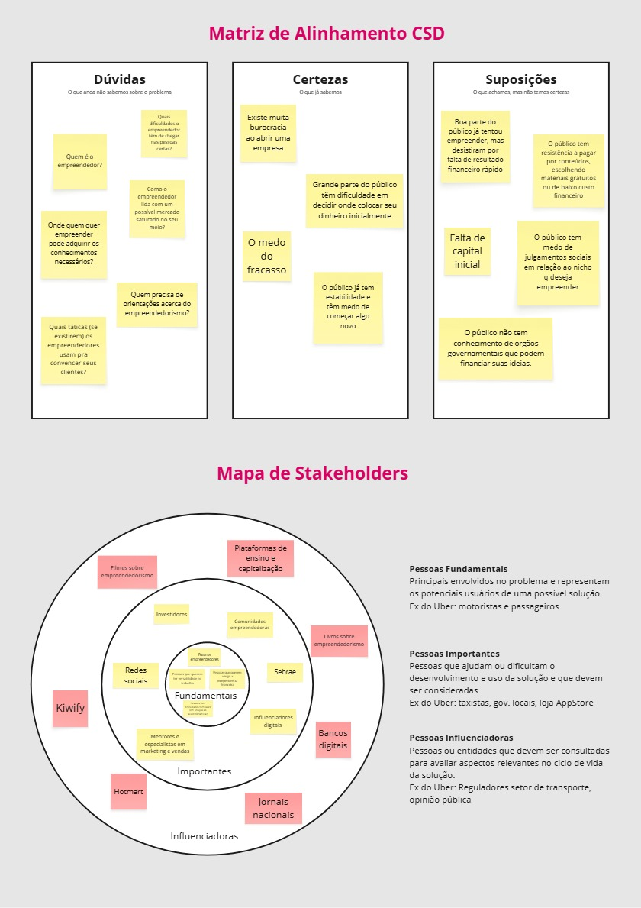
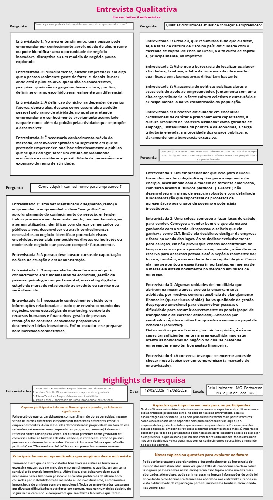
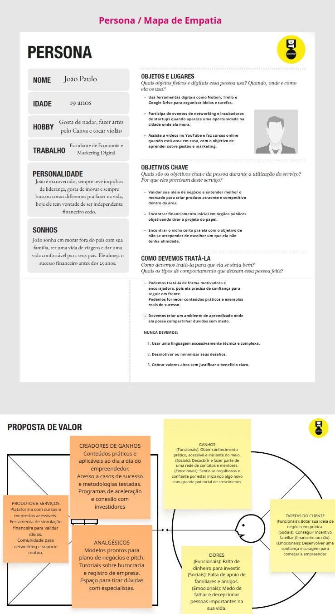
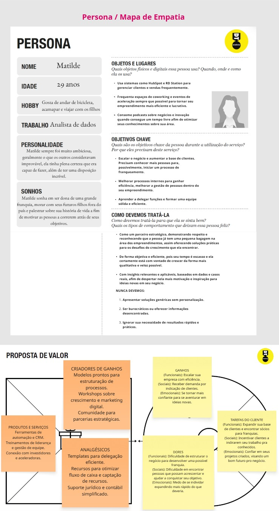
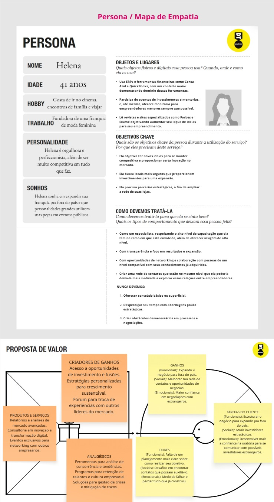

# Introdução

Informações básicas do projeto.

* **Projeto:** [TDR-Consultoria]
* **Repositório GitHub:** [(https://github.com/ICEI-PUC-Minas-PPLES-TI/plf-es-2025-1-ti1-0385100-tdr-consultoria)]
* **Membros da equipe:**

  * [Felipe Giannetti Fontenelle](https://github.com/felipegiannetti)
  * [Raphael Guimarães Reis Dias e Silva](https://github.com/phaelgsilva) 
  * [Filipe José Braga Dias](https://github.com/Felpor-cmd)
  * [Cesar Rodrigues Sokoli de Oliveira](https://github.com/CesarSokoli11) 
  * [Felipe de Castro Fonseca](https://github.com/FelipeFonseca2)

A documentação do projeto é estruturada da seguinte forma:

1. Introdução
2. Contexto
3. Product Discovery
4. Product Design
5. Metodologia
6. Solução
7. Referências Bibliográficas

✅ [Documentação de Design Thinking (MIRO)](files/processo-dt-final.pdf)

# Contexto

# O Problema

O Brasil possui uma das maiores taxas de empreendedorismo do mundo (7ª posição global), com 23,3% da população envolvida em atividades empreendedoras. Milhões de brasileiros buscam no empreendedorismo uma alternativa para geração de renda e crescimento profissional.

### O Problema Principal

**Alta mortalidade empresarial**: Segundo o SEBRAE (2022), 29% das empresas fecham no primeiro ano e 50% não completam quatro anos de operação.

### Principais Causas

- **Falta de planejamento** (35% dos fechamentos)
- **Problemas de gestão financeira** (31% dos casos)
- **Desconhecimento do mercado** (24% dos casos)
- **Ausência de capacitação empresarial** (22% dos casos)

### Manifestações do Problema

1. **Fragmentação do apoio**: Informações e recursos espalhados em múltiplas fontes
2. **Isolamento**: 67% dos empreendedores têm dificuldade para encontrar orientação confiável
3. **Baixa digitalização**: 76% das pequenas empresas não têm presença digital adequada
4. **Falta de networking**: Limitado acesso a mentores e comunidades de apoio

### Impacto

- Perda de investimentos pessoais
- Redução na geração de empregos
- Desperdício do potencial empreendedor nacional
- Perpetuação de desigualdades econômicas

### A Necessidade

Falta uma **plataforma integrada e acessível** que ofereça suporte abrangente aos empreendedores brasileiros, centralizando informações, ferramentas e conexões necessárias para o sucesso empresarial desde a concepção até a consolidação do negócio.


# Objetivos

### Objetivo Geral

Desenvolver uma plataforma web integrada que ofereça suporte abrangente aos empreendedores brasileiros, centralizando recursos, ferramentas e conhecimentos necessários para reduzir a taxa de mortalidade empresarial e facilitar o processo empreendedor desde a concepção da ideia até a consolidação do negócio.

### Objetivos Específicos

**1. Criar um sistema de diagnóstico e planejamento empresarial** Implementar funcionalidades que permitam aos usuários validar suas ideias de negócio, realizar análises de viabilidade e desenvolver planos estruturados, proporcionando uma base sólida para o início do empreendimento.

**2. Desenvolver módulos educacionais práticos e acessíveis** Construir uma biblioteca de conteúdos educativos organizados por temas essenciais (gestão financeira, marketing digital, aspectos legais, gestão operacional), com linguagem simples e aplicação prática voltada à realidade dos pequenos negócios brasileiros.

**3. Estabelecer uma rede de conexões e suporte colaborativo** Implementar funcionalidades de networking que conectem empreendedores entre si e com mentores especializados, criando uma comunidade ativa de apoio mútuo e troca de experiências.

**4. Integrar ferramentas de gestão empresarial simplificadas** Disponibilizar ferramentas básicas de controle financeiro, análise de mercado e gestão de clientes, adaptadas às necessidades e limitações tecnológicas do público-alvo, facilitando a operação diária dos negócios.

**5. Centralizar informações sobre recursos e oportunidades** Organizar e disponibilizar informações atualizadas sobre linhas de crédito, programas governamentais, processos de formalização e oportunidades de mercado, eliminando a fragmentação atual das fontes de informação.

Estes objetivos específicos trabalham de forma complementar para atingir o objetivo geral, abordando as principais causas da alta mortalidade empresarial identificadas na pesquisa do SEBRAE e atendendo às necessidades específicas do público-alvo definido.

# Justificativa

### Relevância Econômica e Social

O desenvolvimento de uma plataforma integrada de apoio ao empreendedorismo se justifica pela urgente necessidade de fortalecer o ecossistema empresarial brasileiro. Segundo o SEBRAE (2022), as micro e pequenas empresas representam 99% do total de empresas no país, são responsáveis por 30% do PIB nacional e geram 54% dos empregos formais, evidenciando seu papel estratégico para a economia nacional.

### Dados Críticos sobre Mortalidade Empresarial

A pesquisa "Sobrevivência das Empresas no Brasil" (SEBRAE, 2022) revela números alarmantes: 29% das empresas fecham no primeiro ano e 50% não completam quatro anos de operação. Os principais fatores incluem falta de planejamento (35%), problemas de gestão financeira (31%), desconhecimento do mercado (24%) e ausência de capacitação empresarial (22%).

### Pesquisa Primária Realizada pelo Grupo

Nossa equipe realizou uma pesquisa com 15 empreendedores de micro e pequenas empresas na região metropolitana de Belo Horizonte entre março e abril de 2024, obtendo os seguintes resultados:

**Principais Dificuldades:**

- 82% relataram dificuldades para encontrar informações confiáveis sobre gestão empresarial
- 71% não tiveram acesso a orientação adequada antes de abrir o negócio
- 78% consideram que ferramentas de planejamento poderiam ter evitado problemas iniciais
- 89% demonstraram interesse em uma plataforma que centralizasse recursos de apoio

**Networking e Mentoria:**

- 73% sentem-se isolados em sua jornada empreendedora
- 84% acreditam que conexões com outros empreendedores seriam valiosas
- Apenas 18% participam de alguma rede de apoio estruturada

**Aspectos Tecnológicos:**

- 91% utilizam smartphone como principal dispositivo
- 76% preferem conteúdo objetivo e prático
- 67% estariam dispostos a usar uma plataforma gratuita de apoio empresarial

### Lacunas no Suporte Atual

Dados do SEBRAE mostram que apenas 38% dos empreendedores brasileiros têm acesso a programas estruturados de capacitação. Nossa pesquisa confirmou que 87% consideram as soluções atuais fragmentadas e de difícil acesso.

### Justificativa dos Objetivos Específicos

Os objetivos específicos foram definidos com base nas evidências coletadas:

- **Sistema de diagnóstico:** 71% iniciam sem orientação adequada
- **Módulos educacionais:** 82% têm dificuldade para encontrar informação confiável
- **Rede de conexões:** 73% sentem-se isolados e apenas 18% participam de redes de apoio
- **Ferramentas simplificadas:** Problemas de gestão respondem por mais de 60% dos fechamentos (SEBRAE)
- **Centralização:** 87% consideram soluções atuais fragmentadas

### Potencial de Impacto

Uma redução de 5% na taxa de mortalidade empresarial representaria a preservação de aproximadamente 750 mil empresas no país, com impacto direto na economia e geração de empregos.

Os dados comprovam uma demanda real e urgente por uma solução integrada de apoio ao empreendedorismo, justificando plenamente o desenvolvimento desta plataforma.


# Público-Alvo

### Perfil Demográfico Principal

**Faixa Etária:** 25 a 45 anos  
**Gênero:** Ambos os sexos, com ligeira predominância feminina (52%)  
**Escolaridade:** Ensino médio completo a superior completo  
**Renda Familiar:** Entre R$ 2.500 a R$ 8.000 mensais  
**Localização:** Principalmente regiões metropolitanas e cidades do interior com mais de 50 mil habitantes

### Segmentação por Estágio Empreendedor

#### 1. Aspirantes a Empreendedores (30%)

- **Perfil:** Funcionários CLT ou estudantes que desejam empreender
- **Idade:** 22-35 anos
- **Motivação:** Busca por independência financeira ou insatisfação profissional
- **Conhecimento Tecnológico:** Intermediário a avançado
- **Necessidades:** Validação de ideias, orientação inicial, planejamento

#### 2. Empreendedores Iniciantes (40%)

- **Perfil:** Negócio com até 2 anos de operação
- **Situação:** Formalizados ou em processo de formalização
- **Principal Desafio:** Gestão básica e sustentabilidade financeira
- **Conhecimento Tecnológico:** Básico a intermediário
- **Necessidades:** Ferramentas de gestão, capacitação, networking

#### 3. Empreendedores Estabelecidos (30%)

- **Perfil:** Negócio com mais de 2 anos, buscando crescimento
- **Faturamento:** Acima de R$ 10.000 mensais
- **Principal Desafio:** Expansão e inovação
- **Conhecimento Tecnológico:** Intermediário
- **Necessidades:** Estratégias de crescimento, acesso a crédito, novos mercados

### Segmentação por Setor de Atuação

- **Comércio Varejista** (35%): Lojas físicas e online
- **Serviços Diversos** (25%): Consultoria, reparos, serviços pessoais
- **Alimentação** (20%): Restaurantes, delivery, food trucks
- **Beleza e Estética** (12%): Salões, clínicas, produtos de beleza
- **Tecnologia e Serviços Digitais** (8%): Desenvolvimento, marketing digital

### Relação com a Tecnologia

#### Usuários Básicos (45%)

- Utilizam principalmente smartphone
- Preferem interfaces simples e intuitivas
- Consomem conteúdo via WhatsApp e redes sociais
- Necessitam de tutoriais e suporte

#### Usuários Intermediários (40%)

- Confortáveis com aplicativos diversos
- Utilizam computador para gestão
- Buscam ferramentas que otimizem processos
- Adaptam-se rapidamente a novas tecnologias

#### Usuários Avançados (15%)

- Dominam múltiplas plataformas digitais
- Interessados em integrações e automações
- Podem atuar como multiplicadores na plataforma
- Potenciais mentores para outros usuários

### Características Comportamentais

#### Motivações Principais

- **Independência financeira** (68%)
- **Flexibilidade de horários** (52%)
- **Realização pessoal** (45%)
- **Necessidade econômica** (38%)

#### Principais Desafios

- Falta de conhecimento em gestão (72%)
- Dificuldade de acesso a informações confiáveis (78%)
- Isolamento profissional (73%)
- Problemas com marketing digital (47%)

#### Preferências de Aprendizado

- **Conteúdo prático e aplicável** (85%)
- **Vídeos curtos e objetivos** (67%)
- **Exemplos reais de sucesso** (74%)
- **Interação com pares** (63%)

### Perfil Socioeconômico Regional

Com base em nossa pesquisa em Belo Horizonte:

- **Classe C** (48%): Renda familiar entre R$ 2.500-5.000
- **Classe B** (35%): Renda familiar entre R$ 5.000-8.000
- **Classe D/E** (17%): Renda familiar até R$ 2.500

### Stakeholders Secundários

#### Mentores e Especialistas

- Empresários experientes dispostos a compartilhar conhecimento
- Consultores e profissionais especializados
- Representantes de instituições de apoio (SEBRAE, associações)

#### Instituições Parceiras

- Órgãos governamentais de fomento
- Instituições financeiras
- Universidades e centros de pesquisa
- Associações empresariais

### Expectativas da Plataforma

- **Gratuidade ou baixo custo** (89%)
- **Interface mobile-friendly** (91%)
- **Informações práticas e atualizadas** (87%)
- **Networking facilitado** (84%)
- **Suporte personalizado** (76%)

# Product Discovery

## Etapa de Entendimento

**Matriz CSD e Stakeholders:**
**Entrevistas qualitativas e highlights de pesquisa:** 

## Etapa de Definição

### Personas

**Persona 1:**
**Persona 2:**
**Persona 3:**

# Product Design

Nesse momento, vamos transformar os insights e validações obtidos em soluções tangíveis e utilizáveis. Essa fase envolve a definição de uma proposta de valor, detalhando a prioridade de cada ideia e a consequente criação de wireframes, mockups e protótipos de alta fidelidade, que detalham a interface e a experiência do usuário.

# Histórias de Usuários

| EU COMO...               | QUERO/PRECISO...                                                     | PARA...                                                             |
| ------------------------ | -------------------------------------------------------------------- | ------------------------------------------------------------------- |
| Aspirante a empreendedor | Validar minha ideia de negócio através de questionários e análises   | Reduzir riscos antes de investir tempo e dinheiro no empreendimento |
| Empreendedor iniciante   | Criar um plano de negócios com templates e orientações passo-a-passo | Estruturar adequadamente minha empresa e ter direcionamento claro   |
| Empreendedor iniciante   | Calcular viabilidade financeira e ponto de equilíbrio                | Entender se meu negócio será sustentável financeiramente            |

### Contexto: Capacitação e Aprendizado

| EU COMO...                                  | QUERO/PRECISO...                                                  | PARA...                                                      |
| ------------------------------------------- | ----------------------------------------------------------------- | ------------------------------------------------------------ |
| Empreendedor com dificuldades em gestão     | Acessar cursos práticos sobre gestão financeira e administrativa  | Organizar melhor meu negócio e evitar problemas operacionais |
| Pequeno empresário sem conhecimento digital | Aprender marketing digital através de conteúdo simples e objetivo | Divulgar meu negócio online e alcançar mais clientes         |
| Empreendedor que precisa se formalizar      | Ter orientações claras sobre processos de abertura de empresa     | Regularizar minha situação e operar dentro da legalidade     |

### Contexto: Networking e Mentoria

| EU COMO...                        | QUERO/PRECISO...                                               | PARA...                                                                |
| --------------------------------- | -------------------------------------------------------------- | ---------------------------------------------------------------------- |
| Empreendedor que se sente isolado | Conectar-me com outros empreendedores da minha região ou setor | Trocar experiências e criar uma rede de apoio mútuo                    |
| Empresário em crescimento         | Ter acesso a mentores experientes para orientação estratégica  | Receber conselhos qualificados e acelerar o desenvolvimento do negócio |

### Contexto: Gestão e Ferramentas

| EU COMO...                                     | QUERO/PRECISO...                                           | PARA...                                                           |
| ---------------------------------------------- | ---------------------------------------------------------- | ----------------------------------------------------------------- |
| Microempreendedor com dificuldades financeiras | Utilizar ferramentas simples de controle de fluxo de caixa | Organizar as finanças e ter visibilidade sobre a saúde financeira |
| Empresário que busca crescimento               | Analisar informações sobre meu mercado e concorrência      | Posicionar melhor meu produto e identificar oportunidades         |

### Contexto: Acesso a Recursos

| EU COMO...                          | QUERO/PRECISO...                                             | PARA...                                                              |
| ----------------------------------- | ------------------------------------------------------------ | -------------------------------------------------------------------- |
| Empreendedor que precisa de capital | Conhecer e comparar diferentes linhas de crédito disponíveis | Escolher a melhor opção de financiamento para minha necessidade      |
| Pequeno empresário                  | Acessar templates de contratos e documentos empresariais     | Formalizar acordos e processos sem precisar contratar serviços caros |

### Contexto: Acompanhamento e Suporte

| EU COMO...            | QUERO/PRECISO...                                                      | PARA...                                                    |
| --------------------- | --------------------------------------------------------------------- | ---------------------------------------------------------- |
| Usuário da plataforma | Ter um painel personalizado com meu progresso e lembretes             | Acompanhar minha evolução e não perder prazos importantes  |
| Empreendedor ativo    | Receber notificações sobre novos conteúdos e oportunidades relevantes | Manter-me atualizado e aproveitar oportunidades do mercado |

### Contexto: Administração da Plataforma

| EU COMO...               | QUERO/PRECISO...                                                | PARA...                                                         |
| ------------------------ | --------------------------------------------------------------- | --------------------------------------------------------------- |
| Administrador do sistema | Gerenciar usuários e seus perfis de acesso                      | Manter a segurança e organização da plataforma                  |
| Mentor credenciado       | Gerenciar minha agenda de atendimentos e histórico de mentorias | Organizar meu tempo e acompanhar o progresso dos empreendedores |

## Proposta de Valor


# Requisitos

As tabelas que se seguem apresentam os requisitos funcionais e não funcionais que detalham o escopo do projeto.

### Requisitos Funcionais

| ID     | Descrição do Requisito                                                     | Prioridade |
| ------ | -------------------------------------------------------------------------- | ---------- |
| RF-001 | Permitir que usuários se cadastrem na plataforma com dados básicos         | ALTA       |
| RF-002 | Permitir autenticação de usuários com email e senha                        | ALTA       |
| RF-003 | Disponibilizar questionário de validação de ideias de negócio              | ALTA       |
| RF-004 | Gerar relatório de viabilidade com pontuação e recomendações               | ALTA       |
| RF-005 | Fornecer templates de plano de negócios personalizáveis por setor          | ALTA       |
| RF-006 | Disponibilizar calculadora de viabilidade financeira e ponto de equilíbrio | MÉDIA      |
| RF-007 | Oferecer biblioteca de cursos organizados por temas empresariais           | ALTA       |
| RF-008 | Permitir que usuários se conectem através de perfis e grupos               | MÉDIA      |
| RF-009 | Disponibilizar sistema de mensagens entre usuários                         | BAIXA      |
| RF-010 | Permitir agendamento de sessões de mentoria                                | BAIXA      |
| RF-011 | Fornecer guia atualizado sobre formalização de empresas                    | ALTA       |
| RF-012 | Apresentar comparativo de linhas de crédito disponíveis                    | MÉDIA      |
| RF-013 | Disponibilizar dashboard personalizado com progresso do usuário            | MÉDIA      |
| RF-014 | Implementar sistema de busca por conteúdos e usuários                      | BAIXA      |
| RF-015 | Fornecer dados básicos sobre setores econômicos por região                 | BAIXA      |
| RF-016 | Disponibilizar templates de documentos empresariais editáveis              | BAIXA      |
| RF-017 | Permitir avaliação de conteúdos e mentores pelos usuários                  | BAIXA      |
| RF-018 | Enviar notificações sobre novos conteúdos e lembretes                      | MÉDIA      |
| RF-019 | Permitir que administradores gerenciem usuários e permissões               | ALTA       |
| RF-020 | Permitir que mentores gerenciem agenda e histórico de atendimentos         | BAIXA      |

### Requisitos não Funcionais

| ID      | Descrição do Requisito                                                           | Prioridade |
| ------- | -------------------------------------------------------------------------------- | ---------- |
| RNF-001 | O sistema deve ser responsivo para dispositivos móveis, tablets e desktop        | ALTA       |
| RNF-002 | Páginas devem carregar em no máximo 3 segundos                                   | MÉDIA      |
| RNF-003 | O sistema deve estar disponível 99,5% do tempo                                   | ALTA       |
| RNF-004 | Dados sensíveis devem ser criptografados conforme LGPD                           | ALTA       |
| RNF-005 | Interface deve ser intuitiva para usuários com conhecimento básico de tecnologia | ALTA       |
| RNF-006 | Sistema deve suportar até 10.000 usuários simultâneos                            | MÉDIA      |
| RNF-007 | Backup automático dos dados deve ser realizado diariamente                       | MÉDIA      |
| RNF-008 | Sistema deve ser compatível com principais navegadores (Chrome, Firefox, Safari) | ALTA       |
| RNF-009 | Conteúdo deve ser otimizado para carregamento em conexões 3G                     | MÉDIA      |
| RNF-010 | Sistema deve permitir integração com APIs de redes sociais                       | BAIXA      |


# Projeto de Interface

Artefatos relacionados com a interface e a interacão do usuário na proposta de solução.

### Wireframes

Estes são os protótipos de telas do sistema.

<iframe style="border: 1px solid rgba(0, 0, 0, 0.1);" width="800" height="450" src="https://embed.figma.com/design/l7hYLsg3odnHdabNuVVXJZ/Untitled?node-id=0-1&embed-host=share" allowfullscreen></iframe>

https://www.figma.com/design/l7hYLsg3odnHdabNuVVXJZ/Untitled?node-id=0-1&p=f&t=QqqFXmFTULKggifT-0

##### TELA XPTO 

https://felipefonseca2006.wixsite.com/crie-um


### User Flow

https://felipefonseca2006.wixsite.com/crie-um

### Protótipo Interativo

https://felipefonseca2006.wixsite.com/crie-um

# Metodologia

Detalhes sobre a organização do grupo e o ferramental empregado.

## Ferramentas

Relação de ferramentas empregadas pelo grupo durante o projeto.

| Ambiente                    | Plataforma | Link de acesso                                                                        |
| --------------------------- | ---------- | ------------------------------------------------------------------------------------- |
| Editor de codigo            | Vs Code    | https://code.visualstudio.com/                                                        |
| Processo de Design Thinking | Miro       | https://miro.com/app/board/uXjVIRnPJ8M=/?share_link_id=382451119897                   |
| Repositório de código       | GitHub     | https://github.com/ICEI-PUC-Minas-PPLES-TI/plf-es-2025-1-ti1-0385100-tdr-consultoria  |
| Hospedagem do site          | Render     | https://site.render.com/XXXXXXX ⚠️ EXEMPLO ⚠️                                        |
| Protótipo Interativo        | WIXSite    | https://www.wix.com/                                                                  |
| QR Code generator           | GoQR.me    | https://goqr.me/api/                                                                  |
| Banco de dados              | Json Server| https://www.npmjs.com/package/json-server                                             |
| Prototipo Wireframe         | Figma      | https://www.figma.com/                                                                |

## Gerenciamento do Projeto

Divisão de papéis no grupo e apresentação da estrutura da ferramenta de controle de tarefas (Kanban).


# Solução Implementada

Esta seção apresenta todos os detalhes da solução criada no projeto.

## Vídeo do Projeto

O vídeo a seguir traz uma apresentação do problema que a equipe está tratando e a proposta de solução. ⚠️ EXEMPLO ⚠️

[](https://www.youtube.com/embed/70gGoFyGeqQ)

## Funcionalidades

Esta seção apresenta as funcionalidades da solução.Info

##### Funcionalidade 1 - Cadastro de Contatos ⚠️ EXEMPLO ⚠️

Permite a inclusão, leitura, alteração e exclusão de contatos para o sistema

* **Estrutura de dados:** [Contatos](#ti_ed_contatos)
* **Instruções de acesso:**
  * Abra o site e efetue o login
  * Acesse o menu principal e escolha a opção Cadastros
  * Em seguida, escolha a opção Contatos
* **Tela da funcionalidade**:


> ⚠️ **APAGUE ESSA PARTE ANTES DE ENTREGAR SEU TRABALHO**
>
> Apresente cada uma das funcionalidades que a aplicação fornece tanto para os usuários quanto aos administradores da solução.
>
> Inclua, para cada funcionalidade, itens como: (1) titulos e descrição da funcionalidade; (2) Estrutura de dados associada; (3) o detalhe sobre as instruções de acesso e uso.

## Estruturas de Dados

Descrição das estruturas de dados utilizadas na solução com exemplos no formato JSON.Info

##### Estrutura de Dados - Contatos   ⚠️ EXEMPLO ⚠️

Contatos da aplicação

```json
  {
    "id": 1,
    "nome": "Leanne Graham",
    "cidade": "Belo Horizonte",
    "categoria": "amigos",
    "email": "Sincere@april.biz",
    "telefone": "1-770-736-8031",
    "website": "hildegard.org"
  }
  
```

##### Estrutura de Dados - Usuários  ⚠️ EXEMPLO ⚠️

Registro dos usuários do sistema utilizados para login e para o perfil do sistema

```json
  {
    id: "eed55b91-45be-4f2c-81bc-7686135503f9",
    email: "admin@abc.com",
    id: "eed55b91-45be-4f2c-81bc-7686135503f9",
    login: "admin",
    nome: "Administrador do Sistema",
    senha: "123"
  }
```

> ⚠️ **APAGUE ESSA PARTE ANTES DE ENTREGAR SEU TRABALHO**
>
> Apresente as estruturas de dados utilizadas na solução tanto para dados utilizados na essência da aplicação quanto outras estruturas que foram criadas para algum tipo de configuração
>
> Nomeie a estrutura, coloque uma descrição sucinta e apresente um exemplo em formato JSON.
>
> **Orientações:**
>
> * [JSON Introduction](https://www.w3schools.com/js/js_json_intro.asp)
> * [Trabalhando com JSON - Aprendendo desenvolvimento web | MDN](https://developer.mozilla.org/pt-BR/docs/Learn/JavaScript/Objects/JSON)

## Módulos e APIs

Esta seção apresenta os módulos e APIs utilizados na solução

**Images**:

* Unsplash - [https://unsplash.com/](https://unsplash.com/) ⚠️ EXEMPLO ⚠️

**Fonts:**

* Icons Font Face - [https://fontawesome.com/](https://fontawesome.com/) ⚠️ EXEMPLO ⚠️

**Scripts:**

* jQuery - [http://www.jquery.com/](http://www.jquery.com/) ⚠️ EXEMPLO ⚠️
* Bootstrap 4 - [http://getbootstrap.com/](http://getbootstrap.com/) ⚠️ EXEMPLO ⚠️

> ⚠️ **APAGUE ESSA PARTE ANTES DE ENTREGAR SEU TRABALHO**
>
> Apresente os módulos e APIs utilizados no desenvolvimento da solução. Inclua itens como: (1) Frameworks, bibliotecas, módulos, etc. utilizados no desenvolvimento da solução; (2) APIs utilizadas para acesso a dados, serviços, etc.

# Referências

As referências utilizadas no trabalho foram:

* SOBRENOME, Nome do autor. Título da obra. 8. ed. Cidade: Editora, 2000. 287 p ⚠️ EXEMPLO ⚠️

> ⚠️ **APAGUE ESSA PARTE ANTES DE ENTREGAR SEU TRABALHO**
>
> Inclua todas as referências (livros, artigos, sites, etc) utilizados no desenvolvimento do trabalho.
>
> **Orientações**:
>
> - [Formato ABNT](https://www.normastecnicas.com/abnt/trabalhos-academicos/referencias/)
> - [Referências Bibliográficas da ABNT](https://comunidade.rockcontent.com/referencia-bibliografica-abnt/)
